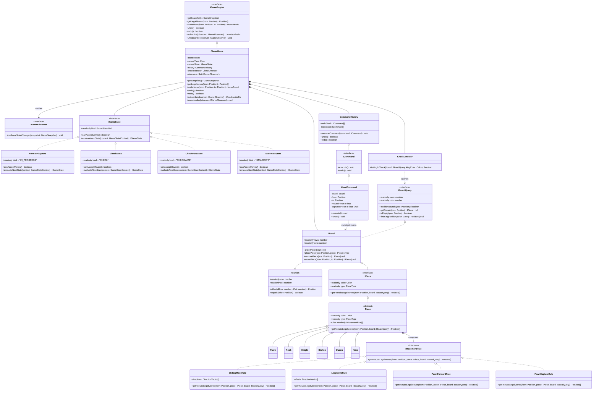

# Arquitectura General del Sistema — Chess TPO

Documento base de arquitectura y decisiones de alto nivel generado como resultado de la **Sub-etapa 2.1 (`grill-with-docs`)**. Define los límites arquitectónicos, el modelo de dominio, los patrones GoF aplicados, los contratos entre módulos y el Diagrama de Clases UML objetivo.

---

## 1. Visión Arquitectónica: Core vs. Adapters (Hexagonal)

El sistema se divide estrictamente en dos anillos con dependencia unidireccional hacia adentro ($\text{Adapters} \longrightarrow \text{Core}$):

```
┌──────────────────────────────────────────────────────────────────────┐
│                   DRIVING ADAPTERS (Infraestructura / UI)            │
│  ┌─────────────────────────┐          ┌───────────────────────────┐  │
│  │ Vitest In-Memory Suite  │          │ React + TS + Tailwind Web │  │
│  └────────────┬────────────┘          └─────────────┬─────────────┘  │
└───────────────┼─────────────────────────────────────┼────────────────┘
                │ Invoca IGameEngine / Seams          │ Invoca IGameEngine + Suscribe IGameObserver
                ▼                                     ▼
┌──────────────────────────────────────────────────────────────────────┐
│                        CORE / DOMAIN (Puro TypeScript)               │
│                                                                      │
│  • Driving Port: IGameEngine (implementado por ChessGame)            │
│  • Patrón State: IGameState (NormalPlay, Check, Checkmate, Stalemate)│
│  • Patrón Command: MoveCommand (execute / undo) + CommandHistory     │
│  • Patrón Observer: IGameObserver (subscribe / unsubscribe)          │
│  • Servicio de Amenazas: CheckDetector                               │
│  • Entidades y Value Objects: Board (IBoardQuery), Piece, Position   │
│  • Composición / Strategy: IMovementRule (Sliding, Leap, Pawn rules) │
└──────────────────────────────────────────────────────────────────────┘
```

### Estructura de Directorios en `proyect/`

```
proyect/
├── src/
│   ├── core/
│   │   ├── ports/          # IGameEngine, IGameObserver, IBoardQuery, GameSnapshot, MoveResult
│   │   ├── game/           # ChessGame, estados IGameState, CommandHistory, MoveCommand
│   │   ├── board/          # Board, Position, BoardSetupFactory
│   │   ├── pieces/         # Piece (base), Pawn, Rook, Knight, Bishop, Queen, King
│   │   └── rules/          # IMovementRule, SlidingMoveRule, LeapMoveRule, PawnForwardRule, PawnCaptureRule, CheckDetector
│   └── adapters/
│       └── web/            # Componentes React + Vite + Tailwind CSS conectados vía IGameEngine / IGameObserver
└── tests/
    └── core/               # Suite unitaria AAA 100% en memoria con Vitest
```

---

## 2. Catálogo de Patrones de Diseño Aplicados

| Patrón / Principio | Dónde se aplica | Rol en el Diseño | ADR de Referencia |
| :--- | :--- | :--- | :--- |
| **Strategy & Composición** | `IPiece` + `IMovementRule[]` (`SlidingMoveRule`, `LeapMoveRule`, `PawnForwardRule`, `PawnCaptureRule`) | Evita jerarquías profundas de herencia y permite crear piezas híbridas (*Fairy Chess*) o agregar *En Passant* sin modificar código existente (*Open/Closed*). | [`ADR-003`](adr/ADR-003-composicion-de-movimientos-en-piezas.md), [`ADR-008`](adr/ADR-008-catalogo-reglas-movimiento-atomicas.md) |
| **Command** | `ICommand` / `MoveCommand` + `CommandHistory` | Encapsula la mutación *in-place* sobre `Board` (`execute()`) y su reversión exacta (`undo()`), tanto para el historial `Undo/Redo` como para simular jugadas al filtrar jaque propio. | [`ADR-004`](adr/ADR-004-estado-mutable-y-patron-command.md), [`ADR-007`](adr/ADR-007-separacion-movimientos-pseudolegales-y-legales.md) |
| **State** | `IGameState` (`NormalPlayState`, `CheckState`, `CheckmateState`, `StalemateState`) | Administra las 4 fases de la partida de forma polimórfica, gobernando la validez de ejecutar jugadas y las transiciones de estado sin bloques `switch`. | [`ADR-009`](adr/ADR-009-patron-state-fases-de-partida.md) |
| **Observer** | `IGameObserver` (`subscribe` / `unsubscribe` en `IGameEngine`) | Notifica cambios de estado emitiendo un `GameSnapshot` inmutable a múltiples suscriptores desacoplados, con rutina explícita de *teardown*. | [`ADR-011`](adr/ADR-011-patron-observer-y-snapshot-para-adaptadores.md) |
| **Interface Segregation (ISP)** | `IBoardQuery` vs. `Board` | Las reglas de movimiento (`IMovementRule`) y `CheckDetector` reciben únicamente la interfaz de solo lectura `IBoardQuery`, impidiendo que muten el tablero. | [`ADR-007`](adr/ADR-007-separacion-movimientos-pseudolegales-y-legales.md) |

---

## 3. Diagrama de Clases UML del Core



---

## 4. Estrategia para la Prueba de Estrés en Defensa Oral ($< 15\text{ min}$)

1. **Inyección de Nueva Pieza Híbrida (*Fairy Chess*, ej. `Archbishop` = Alfil + Caballo o `Chancellor` = Torre + Caballo):**
   * Se crea una nueva clase `Chancellor extends Piece` que pasa `[new SlidingMoveRule(ORTHOGONAL_DIRS), new LeapMoveRule(KNIGHT_OFFSETS)]` al constructor de `Piece`.
   * **Archivos existentes modificados:** `0`. Las reglas de colisión, captura, clavadas, jaque, jaque mate, `MoveCommand` (`undo/redo`) y `GameSnapshot` funcionan automáticamente.
2. **Alteración de Dimensiones del Tablero (ej. $10 \times 10$ o $6 \times 8$):**
   * Se instancia `new Board(10, 10)` y se inyecta en `new ChessGame(board)`.
   * **Archivos existentes modificados:** `0`. Todas las reglas consultan `board.isWithinBounds(pos)` dinámicamente.

---

## 5. Índice de Decisiones Arquitectónicas (ADRs) y Glosario

* **Glosario de Dominio (Lenguaje Ubicuo):** [`docs/glossary.md`](glossary.md)
* **ADRs (Marco *What / Why / When to Break*):**
  1. [`ADR-001`](adr/ADR-001-stack-tecnologico.md): Elección de TypeScript, Vitest y React como Stack Tecnológico.
  2. [`ADR-002`](adr/ADR-002-alcance-y-patrones-objetivo.md): Delimitación del Alcance Objetivo y Patrones Demostradores.
  3. [`ADR-003`](adr/ADR-003-composicion-de-movimientos-en-piezas.md): Modelado de Piezas mediante Clases Nominales que Componen `IMovementRule`.
  4. [`ADR-004`](adr/ADR-004-estado-mutable-y-patron-command.md): Modelo de Tablero Mutable In-Place con Reversión Explícita vía `Command`.
  5. [`ADR-005`](adr/ADR-005-puerto-de-entrada-y-seam-de-testing.md): Fachada `IGameEngine` (`ChessGame`) como Driving Port Único e Inyección de `Board` para Testing.
  6. [`ADR-006`](adr/ADR-006-sistema-de-coordenadas-y-dimensiones.md): Objeto de Valor `Position` 0-Indexed y Límites Parametrizables en `Board`.
  7. [`ADR-007`](adr/ADR-007-separacion-movimientos-pseudolegales-y-legales.md): Separación entre Movimientos Pseudo-Legales (`IMovementRule`) y Movimientos Legales (`CheckDetector` / `ChessGame`).
  8. [`ADR-008`](adr/ADR-008-catalogo-reglas-movimiento-atomicas.md): Catálogo de Reglas Atómicas (`SlidingMoveRule`, `LeapMoveRule`, `PawnForwardRule`, `PawnCaptureRule`).
  9. [`ADR-009`](adr/ADR-009-patron-state-fases-de-partida.md): Aplicación del Patrón `State` para Gestionar las Fases de la Partida (`IGameState`).
  10. [`ADR-010`](adr/ADR-010-resultado-discriminado-moveresult.md): Unión Discriminada `MoveResult` para el Contrato de `makeMove`.
  11. [`ADR-011`](adr/ADR-011-patron-observer-y-snapshot-para-adaptadores.md): Patrón `Observer` con `unsubscribe` Explícito y `GameSnapshot` para Sincronizar Adaptadores.
  12. [`ADR-012`](adr/ADR-012-diseno-adaptador-web-react-tailwind.md): Diseño del Adaptador Web Único (React + Tailwind CSS), Interacción en 2 Clics y Renderizado Resiliente a Extensiones.
